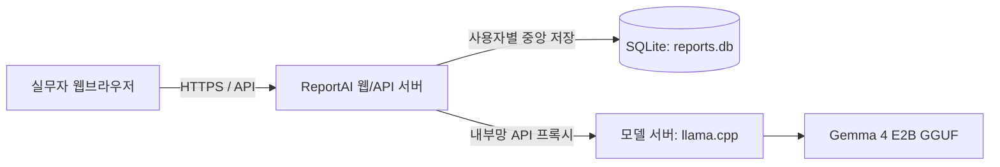
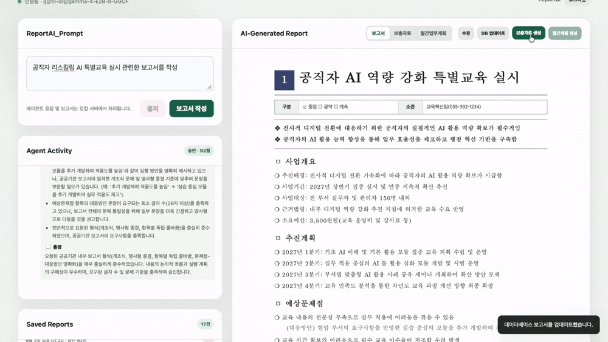

# ReportAI

> **"내년도 업무 보고서, 알아서 짜와."**
>
> **또 시작된 팀장님의 막연한 던지기 지시.**
> 흰 화면만 보며 썼다 지웠다 반복 중이라면?
>
> **보안 걱정 없는 저사양 온프레미스** **ReportAI**로 AX 하세요.

**ReportAI는 지방정부의** 반복되는 보고 업무를 지원하는 온프레미스 기반**의 에이전트(Agent)형 AX 서비스입니다.**


단순히 문서를 자동 생성하는 도구를 넘어, 실무 현장의 불필요한 보고 프로세스를 줄이는 **업무 간소화**와 실무자의 보고·기획 역량을 높이는 **직무 리스킬링(Re-Skilling)**을 함께 목표로 합니다.

생성된 보고서와 보충자료, 월간업무계획은 ReportAI 웹/API 서버의 데이터베이스에 사용자별로 분리 저장합니다.

조직의 내부망에서 운영하는 로컬 LLM을 연결하므로, **내부정보**는 물론 기관의 작성 스타일을 외부 생성형 AI 서비스에 전달하지 않고도 개인별 업무역량을 AI로 강화할 수 있습니다.

## 지방정부 ReportAI가 안내하는 AX 전환 목표

- **막연한 지시의 구조적 문제 해결**: 사업·프로젝트의 다음 연도 과제를 찾아야 하는 실무자가 목적, 현황, 추진 방향을 단계적으로 정리하도록 지원합니다.
- **업무 간소화**: 보고서 초안 작성, 재작성, 검토, 보충자료와 월간업무계획 생성을 하나의 흐름으로 연결해 반복 업무를 줄입니다.
- **직무 리스킬링**: 슈퍼바이저와 문서작성 에이전트의 단계별 피드백을 통해 실무자가 보고서 작성과 계획 수립의 판단 기준을 익히도록 돕습니다.
- **안전한 AX 확산**: 기관 내부에서 통제하는 모델 서버와 개인별 로컬 저장소를 사용해, 현장 실무자가 부담 없이 AI 업무 방식을 적용할 수 있게 합니다.

## 구성



## 핵심 설계

- **온프레미스 로컬 LLM**: `llama.cpp`의 `llama-server`가 GGUF 형식의 Gemma 4 E2B 모델을 실행하고 API를 제공합니다.
- **단계적 모델 확장**: 기본적으로 저용량 Gemma 4 E2B 모델을 사용해 빠르게 시작하고, 보고서의 난이도·기관의 문서 스타일·동시 사용자 수에 맞춰 더 큰 GGUF 모델이나 GPU 자원으로 단계적으로 올릴 수 있습니다. 클라이언트는 API 주소와 모델 서버만 바꾸면 되므로 화면과 개인 데이터베이스를 바꿀 필요가 없습니다.
- **서버·클라이언트 분리**: GPU 서버는 모델 구동만 담당하고, 별도의 ReportAI 웹/API 서버는 화면·인증·저장 API를 제공합니다. 사용자는 Python 설치 없이 기관 내부 웹주소로 접속합니다.
- **사용자별 중앙 저장**: 생성된 보고서, 보충자료, 월간업무계획은 웹/API 서버의 `reports.db`에 계정별로 분리 저장됩니다. API는 로그인 세션을 확인해 다른 사용자의 보고서를 조회·수정·삭제할 수 없게 합니다.
- `report_agent.html`: 브라우저 사용자 화면
- `report_storage_server.py`: 화면 제공, 저장 API, LLM 프록시를 담당하는 로컬 서버
- `agent/`: 에이전트 역할과 작업 단계별 LLM 프롬프트 Markdown 파일
- `reports.db`: 사용자별 보고서, 직무 리스킬 보충자료, 월간업무계획을 저장하는 웹/API 서버 데이터베이스
- `report_agents.py`: 명령줄에서 보고서 작성 흐름을 실행할 때 사용하는 도구

브라우저는 `/api` 상대 경로만 호출합니다. SQLite와 LLM 서버 주소는 Python 로컬 서버가 처리하므로 화면 파일을 직접 열지 말고 로컬 서버 주소로 접속해야 합니다.

## Agent 프롬프트 손쉬운 환경설정

화면 왼쪽의 **환경설정**에서 슈퍼바이저, 보고서 작성 에이전트, 보고서(기관 서식) 작성·재작성·검토, 보충자료 생성, 월간계획 생성 프롬프트를 선택해 수정할 수 있습니다.

저장하면 `agent/`의 해당 Markdown 파일에 반영되며 다음 생성부터 즉시 적용됩니다.

템플릿형 프롬프트의 `{{request}}`, `{{document}}`, `{{planning_year}}` 같은 자리표시자는 생성 시 실제 요청·보고서·연도로 자동 치환됩니다.

자리표시자 이름을 바꾸거나 삭제하면 해당 단계에 필요한 정보가 전달되지 않을 수 있으므로 유지하는 것을 권장합니다.

## 서비스 주요 기능

### 보고서 기반 직무 리스킬 생성 및 확인

저장된 보고서를 바탕으로 신규 실무자가 업무를 이해하고 적용할 수 있는 직무 리스킬 학습 가이드를 생성합니다. 보고서 보기 영역의 **보충자료 생성**을 선택하면 핵심 용어, 기술 습득 로드맵, 실무 적용 절차, 실습 과제와 점검표를 확인할 수 있습니다.



### 프로젝트 실행을 위한 월별 추진계획

보고서와 직무 리스킬 보충자료를 바탕으로 1월부터 12월까지의 월별 추진계획을 생성합니다. **월간계획 생성**을 선택하면 준비, 실행, 점검, 협업 또는 학습 활동을 월별로 확인하고 수정할 수 있습니다.


### 리포트 수정

생성된 보고서는 **수정** 기능으로 제목, 구분, 소관과 본문을 직접 보완할 수 있습니다. 수정 완료 후 **DB 업데이트**를 선택하면 로그인한 사용자의 저장 보고서에 변경 내용이 반영됩니다.


## 사전 준비

- Python 3.10 이상
- [llama.cpp](https://github.com/ggml-org/llama.cpp)의 `llama-server`
- 사용할 GGUF 모델 파일

Python 패키지는 표준 라이브러리만 사용하므로 별도 설치가 필요 없습니다.

## 실행

터미널을 두 개 엽니다.

### 1. llama.cpp 모델 서버 실행

`llama-server`는 GGUF 모델 파일을 메모리에 올리고, ReportAI가 호출할 OpenAI 호환 채팅 API를 제공합니다. 기본 구성은 텍스트 보고서 작성에 적합한 저용량 Gemma 4 E2B 모델입니다.

처음 실행할 때 Hugging Face에서 모델을 받아 캐시에 저장하려면 다음 명령을 사용합니다.

```bash
llama-server -hf ggml-org/gemma-4-E2B-it-GGUF --reasoning off --host 127.0.0.1 --port 8080 --no-mmproj -c 32768 -np 1
```

- `-hf`: 지정한 Hugging Face 모델을 내려받아 실행합니다.
- `--no-mmproj`: ReportAI는 텍스트만 사용하므로 이미지 projector를 내려받지 않습니다.
- `--reasoning off`: 모델의 내부 추론 단계를 응답에 노출하지 않습니다. 내용에 따른 추론기능 `--reasoning off`파라미터를 삭제하면 추론기능이 활성화 됩니다.
- `-c 32768`: 긴 보고서와 참고 문맥을 처리할 수 있도록 컨텍스트를 32,768 토큰으로 설정합니다.
- `-np 1`: 요청 처리 슬롯을 1개로 설정합니다. 동시 사용자가 늘면 서버 메모리 여유를 확인한 뒤 값을 늘립니다.

이미 내려받은 GGUF 모델 파일을 사용한다면 다음과 같이 실행합니다.

```bash
llama-server -m /모델/경로/gemma-4-E2B-it-Q4_K_M.gguf --reasoning off --host 127.0.0.1 --port 8080 --no-mmproj -c 32768 -np 1
```

모델을 더 큰 모델로 올릴 때는 서버의 `-m` 경로 또는 `-hf` 저장소만 변경합니다. GPU 서버에서는 `--n-gpu-layers all`을 추가해 가능한 레이어를 GPU에 배치할 수 있습니다. 모델 크기, 컨텍스트(`-c`), 동시 처리 슬롯(`-np`)을 높일수록 메모리 요구량도 커집니다.

서버 상태는 다음 명령으로 확인합니다.

```bash
curl http://127.0.0.1:8080/health
```

`{"status":"ok"}`가 표시되면 모델 API가 준비된 것입니다.

### 2. ReportAI 웹/API 서버 실행

별도 웹/API 서버에서 ReportAI를 실행합니다. GPU 모델 서버의 내부망 IP를 `--llama-url`에 지정합니다.

```bash
cd /ReportAI_ON/경로
python3 report_storage_server.py --host 0.0.0.0 --llama-url http://<GPU_서버_IP>:8080/v1
```

### 3. 브라우저에서 사용

사용자는 Python 설치 없이 브라우저에서 웹/API 서버 주소를 엽니다.

```text
https://<ReportAI_웹서버_주소>
```

첫 접속 시 중앙에 로그인 창이 표시됩니다. 기존 `reports.db`의 데이터는 서버 시작 시 `reportai` 계정으로 자동 이관되며, 초기 로그인 정보는 다음과 같습니다.

| 항목     | 값           |
| -------- | ------------ |
| 아이디   | `reportai` |
| 비밀번호 | `reportai` |

> [!CAUTION]
> 초기 비밀번호는 테스트 데이터입니다. 기관에 맞게 회원가입 또는 기관 SSO 연동을 추가해서 운영하시기 바랍니다.
>
> 현재 구현은 초기 단일 계정 로그인과 기존 데이터 이관을 위한 구성입니다.

기본 LLM 주소는 `http://127.0.0.1:8080/v1`입니다. LLM 서버 주소가 다른 경우 다음처럼 지정합니다.

```bash
python3 report_storage_server.py --llama-url http://127.0.0.1:8081/v1
```

포트 충돌 시 앱 서버 포트를 변경할 수 있습니다.

```bash
python3 report_storage_server.py --port 8091
```

이 경우 브라우저에서 `http://127.0.0.1:8091`을 엽니다.

## 내부망 서버·클라이언트 운영

기관의 GPU 서버에서 `llama-server`를 실행하고, 별도의 ReportAI 웹/API 서버에서 `report_storage_server.py`를 실행하는 구성을 권장합니다.

사용자는 브라우저 접속만으로 사용하며, 생성 결과물은 웹/API 서버 데이터베이스에 계정별로 저장됩니다.

웹/API 서버와 GPU 서버 사이에는 내부망을 통해 모델 요청과 응답만 오갑니다.

모델 서버에서는 외부 접속이 아닌 기관 내부망 IP로 API를 열고, GPU 사용 시 모델 레이어를 GPU에 배치합니다.

```bash
llama-server -hf ggml-org/gemma-4-E2B-it-GGUF --reasoning off --host 0.0.0.0 --port 8080 --n-gpu-layers all --no-mmproj -c 32768 -np 1
```

ReportAI 웹/API 서버에서는 내부망 모델 서버 주소를 지정해 실행합니다.

```bash
python3 report_storage_server.py --host 0.0.0.0 --llama-url http://<내부망_모델서버_IP>:8080/v1 --secure-cookie
```

`<내부망_모델서버_IP>`에는 기관에서 할당한 서버 IP 또는 내부 DNS 이름을 입력합니다. `--secure-cookie`는 HTTPS 환경에서만 사용합니다. 실제 운영에서는 Nginx 등의 리버스 프록시가 HTTPS를 처리하고, ReportAI 웹/API 서버와 GPU 서버는 외부에 직접 노출하지 않습니다.

## 보고서 데이터 저장

기본 데이터베이스 파일은 ReportAI 웹/API 서버에서 실행한 폴더의 `reports.db`입니다.

다른 위치에 저장하려면 `--database`를 사용합니다.

```bash
python3 report_storage_server.py --database "$HOME/Documents/ReportAI/reports.db"
```

데이터베이스 파일을 백업하면 작성 이력, 보충자료, 월간업무계획을 함께 보관할 수 있습니다.

서버 이전 또는 백업 시에는 서버를 종료한 후 `reports.db` 파일을 복사합니다.

## 보안과 운영

- 로그인 API는 HTTP 전용(HttpOnly) 세션 쿠키를 사용하며, 보고서 API는 로그인한 계정의 데이터만 반환합니다.
- 보고서 내용은 외부 서버에 전송되지 않으며, ReportAI 웹/API 서버의 SQLite와 내부망 `llama-server`에만 전달됩니다.
- 운영 환경에서는 HTTPS, 방화벽 접근 제어, 계정 관리 또는 기관 SSO, 감사 로그를 구성해야 합니다. `report_storage_server.py`는 단일 서버용 경량 구현이므로 다수 사용자 운영에는 PostgreSQL 같은 서버형 데이터베이스 전환을 권장합니다.

## API

클라이언트가 사용하는 API는 모두 동일 출처의 `/api` 아래에 있습니다.

- `GET /api/llm/models`: 실행 중인 로컬 모델 조회
- `POST /api/llm/chat/completions`: `llama-server` 채팅 API 프록시
- `GET /api/prompts`: 모든 에이전트 프롬프트 조회
- `PUT /api/prompts/{name}`: 선택한 에이전트 프롬프트 저장
- `GET/POST /api/reports`: 보고서 목록 조회 및 저장
- `GET/PUT/DELETE /api/reports/{id}`: 보고서 조회, 수정, 삭제
- `POST /api/reports/{id}/supplement`: 보충자료 저장
- `POST /api/reports/{id}/monthly-plan`: 월간업무계획 저장
